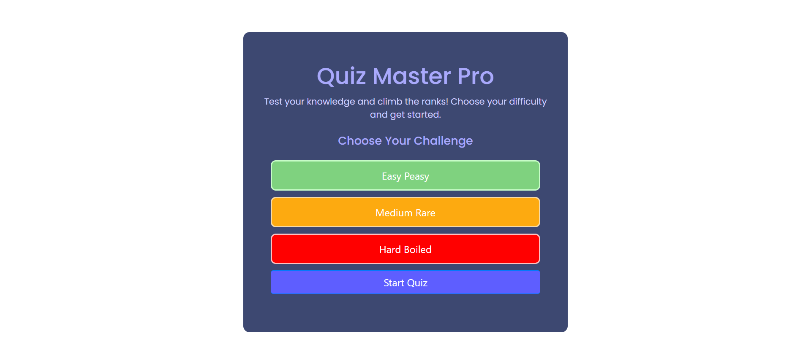
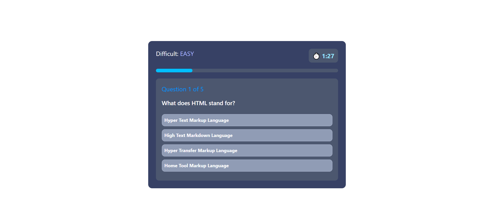
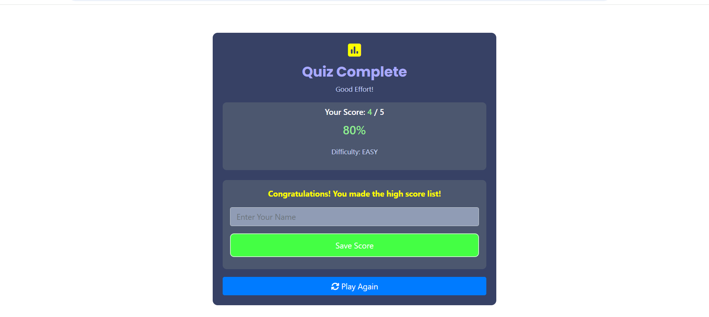

# 🧠 Interactive Web Quiz App

Welcome to the **Web Quiz App** – a responsive, interactive quiz platform built using HTML, CSS, and JavaScript. This app allows users to test their knowledge across three difficulty levels: **Easy**, **Medium**, and **Hard**.

---

## 📌 Objective

Create a quiz application that:
- Offers different difficulty levels
- Displays questions and tracks score
- Times the quiz session
- Saves user scores to `localStorage`
- Shows a results summary on completion

---

## 🎮 Features

- 👇 Difficulty Selection (Easy, Medium, Hard)
- 🧩 5 Questions per quiz session
- ⏱ Countdown timer (90 seconds)
- ✅ Immediate answer feedback (color-based)
- 📊 Real-time progress bar
- 🧾 Score calculation and display
- 💾 Save scores with your name
- 🔄 Play again functionality

---

## ⚙️ Technologies Used

| Tech        | Description                  |
|-------------|------------------------------|
| HTML5       | Semantic structure           |
| CSS3        | Styling with Flexbox & Media Queries |
| JavaScript  | DOM Manipulation, Timer, Quiz Logic |
| localStorage| Persistent score saving      |
| Google Fonts| UI typography styling        |

---
.

📂 Project Structure
bash
Copy
Edit
quiz-app/
├── index.html
├── style.css
├── script.js
├── assets/
│   └──  
└── README.md

📷 Screenshots
🟢 Start Screen

🟣 Quiz in Progress

🟡 Result Summary

🖌️ Styling Highlight
Font: Poppins and Source Code Pro

Color Themes:

Easy: Green

Medium: Orange

Hard: Red

Dark UI with contrast highlights

💡 Future Improvements
Add more questions dynamically via API

Include leaderboard with highest scores

Option to review correct/wrong answers

Add animations and sound feedback

👨‍💻 Author
Virendra Sahu
